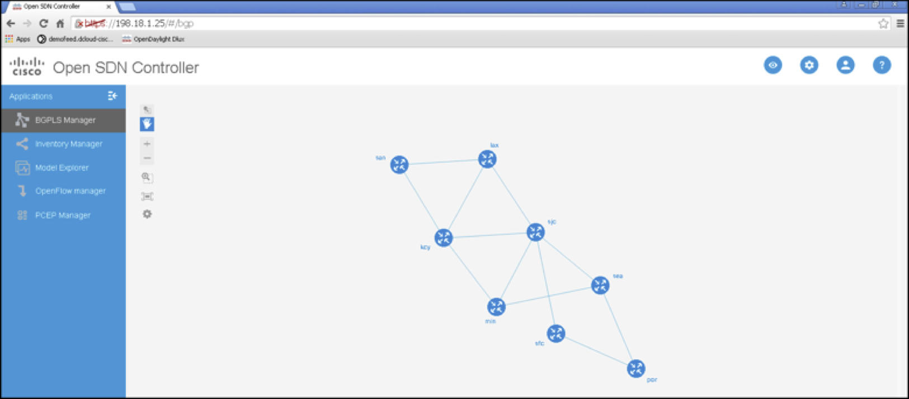
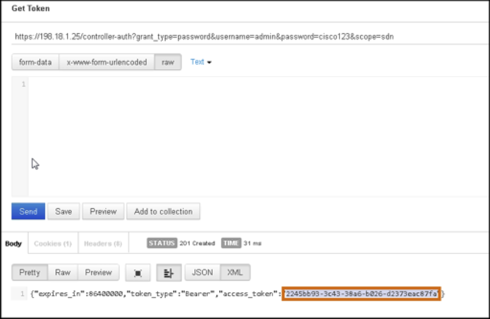
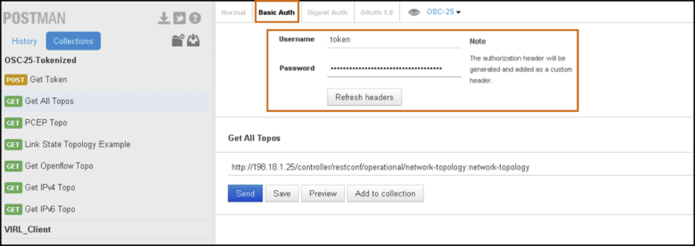

Welcome to the DevNet learning lab for the Cisco Open SDN Controller 1.0 Sandbox v2, with Python!

# About This Cisco Solution
The Cisco Open SDN Controller (COSC) is a commercial distribution of [OpenDaylight](http://http://www.opendaylight.org) that delivers business agility through automation of standards-based network infrastructure.

Built as a highly scalable software-defined networking (SDN) platform, the Open SDN Controller abstracts away the complexity of managing heterogeneous networks to improve service delivery and reduce operating costs.

With the Cisco Open SDN Controller, you can integrate business applications with the underlying network devices using Northbound Rest APIs.  The Rest APIs provide a list of supported base network functions, which are agnostic of the underlying network device manufacturer.

Developer support for COSC may be found in the [COSC community at DevNet.](https://communities.cisco.com/community/developer/networking/cisco-one/extensible-network-controller)

# About This Learning Lab
This learning lab is part of a series of such labs offered by Cisco's [DevNet](http://developer.cisco.com). More such labs are to be found at the [Learning Labs section of DevNet](https://developer.cisco.com/site/devnet/learningLabs/overview.gsp). The code for this lab may be found in the [DevNet organisation in GitHub](https://github.com/CiscoDevNet/cosc-learning-labs). 

This specific instance of the learning lab is being hosted on [Cisco's dCloud platform](http://dcloud.cisco.com). If you have a dCloud account, you can access this learning lab at any time as part of the "Cisco Open SDN Controller 1.0 Sandbox". If you do not have a dCloud account yourself, please contact your Cisco account manager or systems engineer and they will be able to arrange access for you.

# About This Demonstration
The purpose of this Sandbox is to give you access to an early view of the Cisco Open SDN controller. This will take your through the steps of accessing the new Open SDN Controller and then allow you to self-discover different aspects of this product. It will also walk you through using Postman and Python to interact with the Open SDN Controller.

# Demonstration Requirements
The table below outlines the requirements for this preconfigured demonstration. All of this will be provided for you when you are accessing this learning lab during a Cisco Live event. If you are using this learning lab from another location, then you will need to read further

Required are:

*	Computer with Internet Connectivity
*	Cisco.com Login Credentials	

Optionally, you may also use:

*	Cisco AnyConnect
*	Remote Desktop Client Application

# Demonstration Configuration

This learning lab contains preconfigured users and components, running on the [Cisco VIRL](http://virl.cisco.com) platform.
 
All information needed to complete the access components is located in the Topology and Servers menus of your active demonstration. 
Topology Menu. Click on any server in the topology and a popup window will appear with available server options.
Servers Menu. Click on the green trianle in the Topology View, or '+' next to any server name in the Servers view, to display the available server options and credentials.

# Demonstration Topology
When accessing the demo, the topology is a simplified one, as shown in the figure below: 

 
This demonstration uses Virtual Internet Routing Lab [(VIRL)](http://virl.cisco.com). VIRL is a multi-purpose network virtualization platform that provides an easy way to build, configure, and test new or existing network topologies with an intuitive user interface. 

The VIRL topology used for this demonstration, depicted as a single server above, actually consists of eight routers interconnected within the topology. Each router has a management interface connected to the OSC server. Both VIRL and OSC run as Virtual Machines (VMs) on ESXi.

For additional information on VIRL, see this [VIRL video at YouTube.](http://www.youtube.com/watch?v=nsbzHmwUz6I)

# Demonstration Preparation
If you are accessing this learning lab on your own viw dCloud, then follow the steps below to schedule your demonstration and configure your demonstration environment. If you are accessing this learning lab at a Cisco Live event, the learning lab will have been scheduled for you, so you just need to check your AnyConnect connection.

1. Browse to dcloud.cisco.com and login with your Cisco.com credentials.
2. Schedule a demonstration [Show Me How.](http://dcloud-rtp-web-1.cisco.com/dCloud/help/sched_demo.html)
3. Test your connection from the demonstration location before performing any demonstration scenario. [Show Me How](http://dcloud-rtp-web-1.cisco.com/dCloud/help/connect_test.html) 
4. Verify your demonstration has a status of Active under My Demonstrations on the My Dashboard page in the dCloud UI.
* It may take up to 30 minutes for your demonstration to become active. This will not affect you at a Cisco Live event as the learning lab will have been set up for you already.
5.	Connect to the Demonstration, using eith AnyConnect, which is recommended, or Chrome, which will limit your experience. Note that, if you are accessing this learning lab at a Cisco Live event, you will be using AnyConnect:
* Using Cisco AnyConnect [Show Me How](http://dcloud-rtp-web-1.cisco.com/dCloud/help/install_anyconnect_pc_mac.html) 
** After connecting to the demonstration via AnyConnect, use your local RDP client to connect to workstation located at 198.18.133.252. 
** Alternatively, use your own local Chrome client to access the Open SDN controller at 198.18.1.25 
NOTE: You may need to accept a security certificate warning.
•	Using Cisco dCloud Remote Desktop client [Show Me How](http://dcloud-rtp-web-1.cisco.com/dCloud/help/access_demo_wkstn.html) 
NOTE: If you are running RDP, it is highly recommended that you use HTML5 as the default client. [Show Me How](https://dcloud-rtp-web-1.cisco.com/dCloud/help/access_demo_wkstn.html).   
TIP: If using the dCloud webRDP, you can make your RDP session screen larger. To resize, select the corners of the remote desktop window and drag to the desired size.  Right-click anywhere within the grey space of the remote desktop window and select Reload. 
6.	If necessary, log into the workstation with the credentials Administrator / C1sco12345 

# Accessing the OSC
Demonstration Steps
1.	Access the Open SDN Controller in one of two ways:
* If you are connected to the demo via web RDP, on the workstation, use the chrome browser to access the OSC GUI interface at 198.18.1.25
* If you are connected to the demo via Anyconnect:
** Open your own, local browser window and access the OSC GUI interface at 198.18.1.25
** Use a local RDP client to connect to the workstation (at 198.18.133.252 – user credentials Administrator / C1sco12345), and use the workstation chrome browser to access the OSC GUI interface at 198.18.1.25.
2.	For the SDN Controller, use the login credentials admin / cisco123 and click Login.
3.	Welcome to the new Open SDN Controller --- Explore!

 
Caveats: 
*	At this time, you are not be able to use the GUI interface to access router configurations; however, you can telnet into the routers using an ssh client.
*	Please disregard any geographical issues you may find.

# POSTMAN
Many applications and servers today have Representational State Transfer (REST) APIs enabled. REST APIs allow users to access, monitor, and control devices from remote locations. There are many tools available that allow you to exploit the REST API, such as CURL and [POSTMAN](https://chrome.google.com/webstore/detail/postman-rest-client/fdmmgilgnpjigdojojpjoooidkmcomcm?hl=en). This section of the learning lab uses POSTMAN to exploit the REST APIs of the OSC. 

This section walks you through the process of using POSTMAN to interact with the Open SDN Controller. See below for instructions on using Python also.

Note that the Cisco Open SDN Controller REST APIs require authentication, so all REST access must be done using tokens as shown below.

Connect to POSTMAN in one of three ways as described below. For the learning labs at a Cisco Live event, use the Chrome browser on the desktop. Other options are to use an RDP connection to a windows workstation, or your own Postman or REST API client.

In the Cisco Live learning labs, you connect to the demo via AnyConnect and point your local Chrome Browser window directly to the OSC GUI. You can then, in the Chrome browser click the Postman tab, as shown in the figure below.

Under other circumstances, if you are familiar with POSTMAN already, you can use your own, local POSTMAN application by importing the following collections:

* [OSC-25-Tokenized](https://www.getpostman.com/collections/e6f05baf5a3848bf5796)
* [VIRL_Client](https://www.getpostman.com/collections/2bf2256ec14f5d40d314)

Having loaded those collections, or if you are using a Cisco Live learning lab machine, then, in POSTMAN, click the Collections link, then click the OSC-25-Tokenized subheading.

Then click POST Get token. Then, in the middle panel, click Send. You will see the token string in the reply as shown below. You need to copy that, without the quote characters.

You will need to add that authentication token to the headers for the other request. To do that, click GET for Get all topos.

Then, in the middle pane, select the Basic Auth tab. For the username, enter token. Paste the copied token string as a password and click "Refresh headers", then you can click on "Send". Having set the token for one request, you can do the same for other requests in the collection also.

 

# Python DevNet Learning Lab
In the labs section above, you used Postman, which is a browser plugin that allows you to send HTTP requests to REST (Representational State Transfer) APIs on the controller. In the case of the Cisco Open SDN Controller, those APIs are generated from Yang models and exposed via [“RESTCONF”](https://tools.ietf.org/html/draft-ietf-netconf-restconf-04) . 

Another way to call the same APIs is via Python, which is the focus of this section of the lab. The Python code here is presented as a series of scripts that you can run on an Ubuntu VM, available via “ssh cisco@198.18.134.28”. The password is C1sco12345. When you log in, a script will be run to update the VM for this exercise, and so you will need to provide the password so that the script can run with sudo permissions. You can look at the end of the ~/.bashrc file to see what is happening if you are curious.

The scripts (and this document) come from this project in GitHub: 

https://github.com/CiscoDevNet/cosc-learning-labs

On the VM those scripts have been “cloned” into in the ~/git/cosc-learning-labs/src/learning_lab directory. The setup script will put you into that directory automatically and set the appropriate environment variables. If anything below does not work as expected, see the “Troubleshooting” section below.

You will then be able to run scripts in the lab, as below:

* 01_inventory_mount.py – Causes the server to use Netconf to mount the XRv instances in the ../settings/dcloud.py configuration file.

`
$ ./01_inventory_mount.py 
Python Library Documentation: function device_mount in module basics.inventory\n
device_mount(device_name, device_address, device_port, device_username, device_password)\n
Add the specified network device to the inventory of the Controller.\n
device_mount(lax, cisco, cisco, 830, 198.18.1.51)\n
device_mount(san, cisco, cisco, 830, 198.18.1.54)\n
device_mount(sea, cisco, cisco, 830, 198.18.1.55)\n
device_mount(min, cisco, cisco, 830, 198.18.1.52)\n
device_mount(por, cisco, cisco, 830, 198.18.1.53)\n
device_mount(xrvr-999, cisco, cisco, 830, 198.18.1.999)\n
device_mount(sjc, cisco, cisco, 830, 198.18.1.57)\n
device_mount(kcy, cisco, cisco, 830, 198.18.1.50)\n
device_mount(sfc, cisco, cisco, 830, 198.18.1.56)\n
`

Note that the xrvr-999 device is there for test purposes, to show that non-existent devices will not be connected.

*	01_inventory_connected.py – Displays the connected devices:

`
$ ./01_inventory_connected.py 
Python Library Documentation: function inventory_connected in module basics.inventory
inventory_connected()
    Names of network devices connected to the Controller.
    Output a list of names.
    Connected devices are a subset of the inventory.
['sea', 'por', 'san', 'lax', 'sjc', 'sfc', 'kcy', 'min']
`

The output above indicates that the controller has mounted the XRv devices, and that all devices connected properly. If you do not see that they connected properly, try again. It can take a several minutes for all of the network elements to mount and connect.
After that, there are additional sets of scripts to examine certain components and set properties on those components, as appropriate. 

To see which scripts there are, use the “ls” command as shown below (note that this is a just an elided example of what you will see, as the contents will change over time): 

`
$ ls
00_controller.py 01_inventory_unreachable.py 04_static_route_json_all.py
00_devices.py	 02_capability.py 04_static_route_list.py
00_settings.py 02_capability_compare.py	04_story.py
01_device_connect.py 02_capability_discovery.py 04_topology.py
01_device_connected.py 02_capability_matrix.py	05_acl_apply_packet_filter.py
01_device_control.py 03_interface_configuration.py 05_acl_capability.py
…
`

Some of what these scripts cover includes:  

* Inventory
* Netconf/Yang capabilities
* Interfaces
* Routes and Topology
* ACLs

This is a living body of code, and so can vary each time you use this lab.

If you want to modify the list of devices being mounted, edit the ../settings/dcloud.py file. That file is Python code as well.
You can also use the inbuilt Python interpreter to call the functions in the basics library, in the same way that the code in the learning_lab directory does, and you can adapt and modify any of the scripts that you as you like. You will not break anything.

Have at it! 

The Cisco DevNet team – developer.cisco.com.

# Troubleshooting

There are two main problems that can typically arise when working with the Open SDN Controller:
* The controller becomes un-responsive, or responds with 50X errors. This can happen for a variety of reasons, and the simple remedy is to reboot the controller VM as shown below.
*	The network is in some state, with routes, ACLs, interfaces shutdown, or similar, probably because of a previous series of exercises with the same lab instance, that leads to unexpected results. In this case there is a restore_network_state.py script that should reset everything and leave the controller with no mounted devices. If this script does not work, reboot the controller server and try again after five minutes.

The controller “ocs” server can be rebooted from the “Servers” section of your dCloud Dashboard as shown below. Click on the “+” symbol next to the “ocs” server entry, and then select the bottom right “Reboot Guest” button, which has a symbol of circled arrows. 

This reboot will take approximately five minutes.